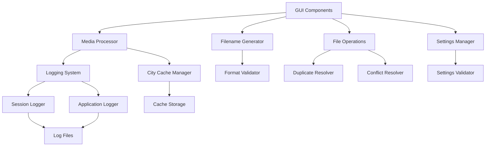

# Design Document - Media File Renamer Improvements

## Overview

This design document outlines the technical approach for implementing comprehensive improvements to the existing Media File Renamer application. The improvements focus on reliability, user experience, and data management through better duplicate handling, persistent caching, enhanced validation, comprehensive logging, and robust error recovery.

The current application follows a modular architecture with separate components for GUI, media processing, filename generation, settings management, and file operations. The improvements will enhance each module while maintaining the existing architecture and adding new capabilities.

## Architecture

### Current Architecture Analysis

The application uses a layered architecture:

- **Presentation Layer**: `gui_components.py` - Tkinter-based GUI
- **Business Logic Layer**: 
  - `media_processor.py` - Metadata extraction and GPS processing
  - `filename_generator.py` - Filename pattern generation
  - `file_operations.py` - File system operations
- **Data Layer**: `settings_manager.py` - Configuration persistence

### Enhanced Architecture

The improvements will add new components and enhance existing ones:



## Components and Interfaces

### 1. Enhanced Logging System

**New Component**: `logging_manager.py`

```python
class LoggingManager:
    def setup_application_logger(self) -> logging.Logger
    def setup_session_logger(self) -> logging.Logger
    def log_operation(self, operation: str, details: dict)
    def log_error(self, error: Exception, context: str)
    def rotate_logs(self)
```

**Integration Points**:
- All existing modules will receive logger instances
- GUI will display logging status
- Session logs will be saved per processing operation

### 2. City Cache Manager

**New Component**: `city_cache.py`

```python
class CityCache:
    def __init__(self, cache_file: str, max_entries: int = 1000)
    def get_city(self, lat: float, lon: float) -> Optional[str]
    def set_city(self, lat: float, lon: float, city: str)
    def load_cache(self) -> bool
    def save_cache(self) -> bool
    def cleanup_cache(self)
    def is_coordinate_cached(self, lat: float, lon: float, tolerance: float = 0.001) -> bool
```

**Integration**: 
- `MediaProcessor` will use cache before making API calls
- Cache will be loaded on startup and saved on shutdown

### 3. Enhanced Format Validator

**Enhanced Component**: `filename_generator.py`

```python
class FormatValidator:
    def validate_format_realtime(self, format_str: str) -> ValidationResult
    def suggest_corrections(self, format_str: str) -> List[str]
    def check_required_placeholders(self, format_str: str) -> List[str]
    def check_invalid_characters(self, format_str: str) -> List[str]
    def get_format_suggestions(self) -> List[str]

@dataclass
class ValidationResult:
    is_valid: bool
    errors: List[str]
    warnings: List[str]
    suggestions: List[str]
```

### 4. Duplicate and Conflict Resolution

**Enhanced Component**: `file_operations.py`

```python
class DuplicateResolver:
    def resolve_duplicates(self, file_mappings: List[Tuple[str, str]]) -> List[Tuple[str, str]]
    def generate_unique_name(self, base_name: str, existing_names: Set[str]) -> str
    def check_conflicts_with_existing(self, folder_path: str, new_names: List[str]) -> Dict[str, str]

class ConflictResolver:
    def resolve_file_conflicts(self, folder_path: str, target_name: str) -> str
    def find_available_name(self, folder_path: str, base_name: str) -> str
```

### 5. Enhanced Settings Validation

**Enhanced Component**: `settings_manager.py`

```python
class SettingsValidator:
    def validate_all_settings(self, settings: dict) -> ValidationResult
    def validate_folder_paths(self, paths: List[str]) -> List[str]
    def validate_filename_formats(self, formats: List[str]) -> List[str]
    def validate_window_geometry(self, geometry: str) -> bool
    def repair_corrupted_settings(self, settings: dict) -> dict
```

### 6. Error Recovery System

**New Component**: `error_recovery.py`

```python
class ErrorRecovery:
    def __init__(self, logger: logging.Logger, max_retries: int = 3)
    def retry_with_backoff(self, func: Callable, *args, **kwargs) -> Any
    def handle_network_error(self, error: Exception, context: str) -> bool
    def handle_file_permission_error(self, filepath: str) -> bool
    def handle_corrupted_file_error(self, filepath: str) -> bool
    def log_and_continue(self, error: Exception, context: str)
```

## Data Models

### Enhanced FileInfo

```python
@dataclass
class FileInfo:
    original_name: str
    original_path: str
    new_name: str
    final_name: str  # After duplicate/conflict resolution
    location: str
    city: str
    has_metadata: bool
    selected: bool = False
    processing_status: ProcessingStatus = ProcessingStatus.PENDING
    error_message: Optional[str] = None

class ProcessingStatus(Enum):
    PENDING = "pending"
    PROCESSING = "processing"
    SUCCESS = "success"
    ERROR = "error"
    SKIPPED = "skipped"
```

### Cache Entry Model

```python
@dataclass
class CacheEntry:
    latitude: float
    longitude: float
    city: str
    timestamp: datetime
    source: str  # API source used
```

### Session Log Model

```python
@dataclass
class SessionLogEntry:
    timestamp: datetime
    operation: str
    old_name: str
    new_name: str
    status: str
    error_message: Optional[str] = None
```

## Error Handling

### Error Categories and Strategies

1. **Network Errors** (GPS API failures):
   - Retry with exponential backoff (1s, 2s, 4s)
   - Fall back to cached data if available
   - Continue processing without city information
   - Log all attempts and final outcome

2. **File System Errors**:
   - Permission denied: Log error, skip file, continue
   - File not found: Log error, mark as missing, continue
   - Disk full: Stop processing, show user error
   - Path too long: Truncate filename, retry once

3. **Metadata Extraction Errors**:
   - Corrupted files: Log error, mark as no metadata, continue
   - Missing ffprobe: Log warning once, continue with image-only processing
   - Invalid EXIF: Log error, mark as no metadata, continue

4. **Application Errors**:
   - Settings corruption: Load defaults, backup corrupted file, continue
   - Cache corruption: Create new cache, backup corrupted file, continue
   - Log file errors: Fall back to console output, continue

### Error Recovery Patterns

```python
# Network retry pattern
async def retry_network_call(func, max_retries=3):
    for attempt in range(max_retries):
        try:
            return await func()
        except NetworkError as e:
            if attempt == max_retries - 1:
                raise
            await asyncio.sleep(2 ** attempt)

# Graceful degradation pattern
def get_city_with_fallback(lat, lon):
    try:
        return api_lookup(lat, lon)
    except NetworkError:
        cached = cache.get(lat, lon)
        if cached:
            return cached
        return ""  # Continue without city
```

## Testing Strategy

### Unit Testing Approach

1. **Core Logic Testing**:
   - Filename generation with various metadata combinations
   - Duplicate resolution algorithms
   - Cache management operations
   - Settings validation logic

2. **Error Handling Testing**:
   - Network failure scenarios
   - File system permission issues
   - Corrupted data handling
   - Invalid input validation

3. **Integration Testing**:
   - End-to-end file processing workflows
   - Settings persistence across sessions
   - Cache persistence and loading
   - Log file creation and rotation

### Test Data Strategy

- **Sample Media Files**: Create test files with various metadata scenarios
- **Mock Network Responses**: Simulate API failures and timeouts
- **Corrupted Files**: Test files with invalid EXIF data
- **Edge Cases**: Very long filenames, special characters, Unicode

### Performance Testing

- **Large File Sets**: Test with 1000+ files
- **Cache Performance**: Measure lookup times with full cache
- **Memory Usage**: Monitor memory consumption during processing
- **UI Responsiveness**: Ensure GUI remains responsive during operations

## Implementation Phases

### Phase 1: Core Infrastructure
- Implement logging system
- Add city cache manager
- Enhance error recovery mechanisms
- Update settings validation

### Phase 2: Duplicate and Conflict Resolution
- Implement duplicate filename resolution
- Add file conflict handling
- Enhance file operations with new resolution logic

### Phase 3: Enhanced Validation and UI
- Implement real-time format validation
- Add format suggestions and error highlighting
- Enhance GUI with validation feedback

### Phase 4: Integration and Polish
- Integrate all components
- Add comprehensive error handling
- Implement session logging
- Performance optimization

## Security Considerations

1. **File System Access**:
   - Validate all file paths to prevent directory traversal
   - Check permissions before attempting operations
   - Sanitize filenames to prevent injection attacks

2. **Network Requests**:
   - Use HTTPS for all API calls
   - Implement request timeouts
   - Validate API responses before processing

3. **Data Storage**:
   - Store cache and logs in user data directory
   - Use appropriate file permissions
   - Validate JSON data before parsing

## Performance Considerations

1. **Caching Strategy**:
   - LRU eviction for city cache
   - Lazy loading of cache data
   - Batch cache saves to reduce I/O

2. **UI Responsiveness**:
   - Use threading for long-running operations
   - Implement progress callbacks
   - Batch GUI updates to reduce flicker

3. **Memory Management**:
   - Process files in batches for large sets
   - Release image objects after metadata extraction
   - Limit log file sizes with rotation

## Backward Compatibility

- Existing settings files will be automatically migrated
- Old filename formats will continue to work
- Current file processing behavior will be preserved
- New features will be opt-in where possible

This design maintains the existing architecture while adding robust improvements that address all requirements for reliability, user experience, and data management.